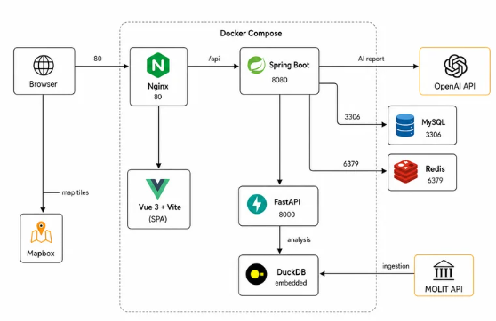

# EstateFlow

> 부동산 정책 충격 전파 분석 및 AI 보고서 생성 서비스

[](https://vuejs.org/)
[](https://spring.io/projects/spring-boot)
[](https://fastapi.tiangolo.com/)
[](https://www.mysql.com/)
[](https://redis.io/)
[](https://duckdb.org/)
[](https://www.docker.com/)

---

## 소개

EstateFlow는 국토교통부 실거래가, 경제지표, 지역 가격지수 데이터를 기반으로 부동산 정책 이벤트 이후 지역별 가격과 거래량 반응을 분석하는 서비스입니다.

지도 히트맵과 타임라인으로 충격 전파 흐름을 확인하고, AI가 분석 결과를 자연어 보고서와 PDF로 생성합니다. 또한 분석 수치를 기반으로 투자자, 실수요자, 임차인 등 시장 참여자 관점의 시나리오를 탐색할 수 있습니다.

---

## 화면 미리보기

### 회원가입


### 로그인 및 마이페이지


### 공지사항 및 Q&A


### 분석


### AI 보고서


### 시나리오 탐색


### 참여자 관점 AI 분석


---

## 주요 기능

| 기능 | 설명 |
| --- | --- |
| 실거래가 ETL 파이프라인 | 국토교통부 실거래가 데이터를 수집하고 취소 거래, 이상치, 면적 기준을 보정해 분석 데이터로 정제 |
| 이벤트 기반 분석 | 정책·시장 이벤트 전후의 가격 변화율, 거래량 변화율, 반응 시차, 충격 강도 점수 산출 |
| 지도 시각화 | Mapbox GL 기반 지역별 히트맵, 타임라인 슬라이더, 반응 지역 TOP 5 패널 제공 |
| AI 분석 보고서 | Spring AI와 OpenAI 호환 API를 활용해 분석 결과를 자연어 보고서와 PDF로 생성 |
| 시나리오 탐색 | 분석 수치를 규칙 기반 상태 변화로 반영하고, LLM이 시장 참여자 관점의 반응을 설명 |
| 실거래가 조회 | 지역과 연월 기준 아파트 매매 실거래가 목록 조회 |
| 회원 및 게시판 | JWT 인증, 마이페이지, 공지사항, Q&A 등록 및 답변 관리 |

---

## 기술 스택

### Frontend

| 분류 | 기술 |
| --- | --- |
| Framework | Vue 3 |
| Build | Vite |
| Language | TypeScript |
| Routing | Vue Router |
| 상태 관리 | Pinia |
| HTTP | Axios |
| 지도 | Mapbox GL |
| 온보딩 | driver.js |
| 코드 품질 | ESLint, OxLint, Prettier |

### Backend

| 분류 | 기술 |
| --- | --- |
| Main API | Spring Boot 4, Java 21 |
| DB 접근 | MyBatis |
| 인증/인가 | Spring Security, JWT |
| AI | Spring AI, OpenAI 호환 Chat Completions API |
| Cache | Redis |
| PDF | Thymeleaf, OpenHTMLtoPDF |
| API 문서 | SpringDoc OpenAPI, Swagger UI |
| Analysis API | FastAPI, uvicorn |
| 분석 DB | DuckDB |
| 데이터 처리 | pandas, numpy |

### Infrastructure

| 분류 | 기술 |
| --- | --- |
| 컨테이너 | Docker, Docker Compose |
| RDB | MySQL 8 |
| Cache | Redis 7 |
| 분석 저장소 | DuckDB |
| 정적 서빙 | Nginx |
| 데이터 형식 | Parquet, DuckDB file |

---

## 시스템 아키텍처



---

## 프로젝트 구조

```text
EstateFlow/
├─ docker-compose.yml                 # 통합 Docker Compose 실행 파일
├─ frontend/                          # Vue 3 + Vite SPA
│  ├─ Dockerfile                       # 프론트 빌드 후 Nginx 정적 서빙
│  ├─ nginx.conf                       # /api 프록시 및 SPA fallback 설정
│  └─ src/
│     ├─ views/                        # 화면 단위 페이지
│     ├─ components/                   # 공통/도메인 컴포넌트
│     ├─ stores/                       # Pinia store
│     ├─ api/                          # Axios API 클라이언트
│     └─ router/                       # Vue Router 설정
├─ backend-spring/
│  ├─ Dockerfile                       # Spring Boot 컨테이너 빌드
│  ├─ scripts/sql/                     # schema, migration, dummy data
│  └─ backend/src/main/java/           # Spring Boot 애플리케이션
├─ backend-fastAPI/
│  ├─ Dockerfile                       # FastAPI 컨테이너 빌드
│  ├─ app/                             # 분석 API, 서비스, 스키마
│  ├─ processed/                       # 전처리 데이터
│  └─ result/                          # DuckDB 파일
└─ docs/                               # 산출물 및 화면 이미지
```

---

## Docker Compose 실행

### 사전 요구사항

- Docker Desktop 또는 Docker Engine
- Docker Compose v2
- `backend-spring/backend/.env` 파일
- 프론트 화면을 Docker로 확인하려면 `frontend/.env.local` 파일

### 1. 환경 변수 준비

Spring 서버는 `backend-spring/backend/.env` 파일을 읽습니다. 최소한 아래 값은 프로젝트 환경에 맞게 준비해야 합니다.

```env
JWT_SECRET_KEY=32자_이상의_서명_키
OPENAI_API_KEY=OpenAI_또는_호환_API_키
OPENAI_MODEL=gpt-4o-mini
OPENAI_BASE_URL=https://api.openai.com/v1
OPENAI_CHAT_COMPLETIONS_PATH=chat/completions
molit.api.service-key=국토교통부_서비스키
```

프론트에서 Mapbox 지도를 사용하려면 `frontend/.env.local`에 토큰을 설정합니다.

```env
VITE_MAPBOX_TOKEN=Mapbox_Public_Token
```

> Docker 실행 시 `DB_URL`, `REDIS_HOST`, `AI_SERVER_URL`은 `docker-compose.yml`에서 컨테이너 서비스명 기준으로 자동 override됩니다.

### 2. 백엔드 전체 실행

루트 디렉터리에서 실행합니다.

```bash
docker compose up --build
```

기본 실행 대상은 `mysql`, `redis`, `fastapi`, `spring`입니다.

### 3. 프론트까지 포함해서 실행

프론트 컨테이너는 `frontend` profile에 포함되어 있습니다.

```bash
docker compose --profile frontend up --build
```

### 4. 접속 주소

| 대상 | URL |
| --- | --- |
| Frontend | `http://localhost` |
| Spring API | `http://localhost:8080` |
| Spring Swagger UI | `http://localhost:8080/swagger-ui.html` |
| FastAPI | `http://localhost:8000` |
| FastAPI Docs | `http://localhost:8000/docs` |
| MySQL | `localhost:3307` |
| Redis | `localhost:6379` |

---

## Compose 서비스 구성

| 서비스 | 컨테이너 | 설명 |
| --- | --- | --- |
| `mysql` | `estateflow-mysql` | MySQL 8.0. 최초 실행 시 schema, migration, dummy data 자동 적용 |
| `redis` | `estateflow-redis` | JWT refresh token 및 캐시 저장소 |
| `fastapi` | `estateflow-fastapi` | DuckDB 기반 분석 API 서버 |
| `spring` | `estateflow-spring` | 인증, 회원, 게시판, 분석 중계, AI 보고서, 시나리오 API |
| `frontend` | `estateflow-frontend` | Vue 빌드 결과물을 Nginx로 서빙 |

MySQL 초기화 SQL은 Docker volume이 비어 있을 때만 실행됩니다. 스키마를 처음부터 다시 적용해야 하면 volume까지 삭제한 뒤 재실행합니다.

```bash
docker compose down -v
docker compose --profile frontend up --build
```

---

## Docker 문제 해결

### 프론트 빌드 중 node_modules 관련 오류

다음과 같은 오류가 발생하면 Docker build cache나 로컬 `node_modules`가 빌드 컨텍스트에 섞인 경우일 수 있습니다.

```text
cannot replace to directory ... /app/node_modules/@tsconfig/node24 with file
```

아래 순서로 캐시를 정리하고 프론트 이미지를 다시 빌드합니다.

```bash
docker compose down
docker builder prune
docker compose build --no-cache frontend
docker compose --profile frontend up
```

`frontend/.dockerignore`에는 최소한 아래 항목이 포함되어 있어야 합니다.

```text
node_modules
dist
.env
.env.*
!.env.local
```

### DB 초기화 데이터가 반영되지 않을 때

MySQL volume이 이미 생성되어 있으면 `docker-entrypoint-initdb.d`의 SQL이 다시 실행되지 않습니다.

```bash
docker compose down -v
docker compose up --build
```

---

## 개별 로컬 실행

Docker Compose가 기본 실행 방식입니다. 특정 서버만 디버깅해야 할 때는 아래 방식으로 개별 실행할 수 있습니다.

### Spring Boot

```bash
cd backend-spring/backend
./mvnw spring-boot:run
```

로컬 실행 시 `DB_URL`, `REDIS_HOST`, `AI_SERVER_URL`은 로컬 주소 기준으로 설정해야 합니다.

### FastAPI

```bash
cd backend-fastAPI
python -m venv .venv

# Windows
.venv\Scripts\activate
# macOS / Linux
source .venv/bin/activate

pip install -r requirements.txt
uvicorn app.main:app --reload
```

### Frontend

```bash
cd frontend
npm install
npm run dev
```

개발 서버는 기본적으로 `http://localhost:5173`에서 실행됩니다.

---

## 주요 API

프론트엔드는 Spring API(`/api/*`)를 호출하고, Spring 서버가 필요한 경우 FastAPI 분석 서버를 내부 호출합니다.

### Spring API

| Method | Path | 설명 |
| --- | --- | --- |
| `GET` | `/api/analysis/events` | 분석 이벤트 목록 조회 |
| `POST` | `/api/analysis/event-window` | 이벤트 기준 지역별 충격 분석 |
| `POST` | `/api/reports` | AI 보고서 생성 |
| `GET` | `/api/reports/my` | 내 보고서 목록 조회 |
| `GET` | `/api/reports/{reportId}/pdf` | 보고서 PDF 다운로드 |
| `POST` | `/api/scenarios` | 시나리오 생성 |
| `POST` | `/api/scenarios/{id}/rounds/{month}/explanation` | 라운드별 AI 설명 생성 |

### FastAPI

| Method | Path | 설명 |
| --- | --- | --- |
| `GET` | `/events/json` | 이벤트 목록 조회 |
| `POST` | `/analysis/event-window` | 이벤트 기준 분석 |
| `POST` | `/api/batch/import/sale-data` | MOLIT 실거래 데이터 수집 배치 |
| `POST` | `/api/batch/register-parquet-files` | Parquet 파일 DuckDB 등록 |
| `GET` | `/api/batch/status` | 데이터 적재 상태 확인 |

---

## 분석 개념

| 개념 | 정의 |
| --- | --- |
| 반응 시차 | 이벤트 발생 후 해당 지역이 임계 변화율을 처음 초과한 시점까지의 차이 |
| 충격 전파 | 선행 반응 지역에서 후행 반응 지역으로 가격과 거래량 변화가 확산되는 흐름 |
| 풍선효과 | 규제 지역 거래 감소 후 인접 또는 대체 지역 거래가 증가하는 수요 이동 패턴 |
| 충격 강도 점수 | 가격 변화율과 거래량 변화율을 가중 합산한 영향도 점수 |
| 페르소나 | 투자자, 실수요자, 갈아타기 수요층 등 시나리오 탐색에 사용되는 시장 참여자 유형 |

본 서비스는 미래 가격을 예측하기보다 과거 이벤트 이후의 반응 패턴을 탐색하는 데 초점을 둡니다. 분석 결과는 인과관계가 아닌 상관관계 기반 해석으로 사용해야 합니다.

---

## 관련 문서

- [AI 활용 구현 보고서](docs/ai-report/EstateFlow_AI_활용_구현_보고서.docx)
- [클래스 다이어그램](docs/산출물/class-diagram.md)
- [화면 설계서](docs/산출물/화면_설계서.md)
- [기능 명세서](docs/산출물/기능_명세서.md)

