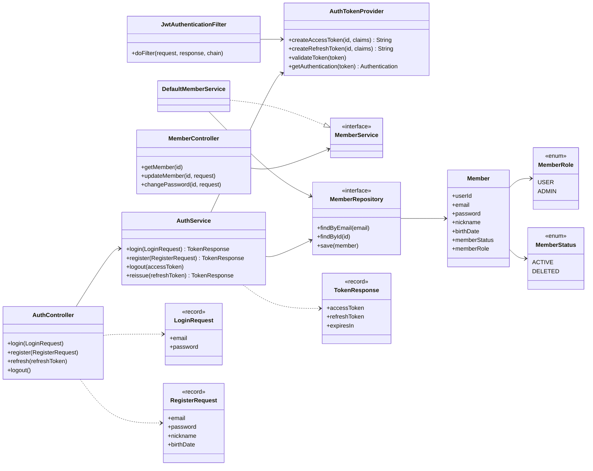
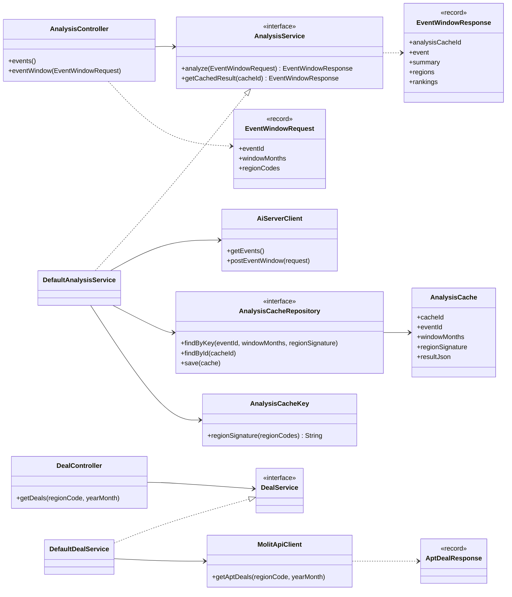
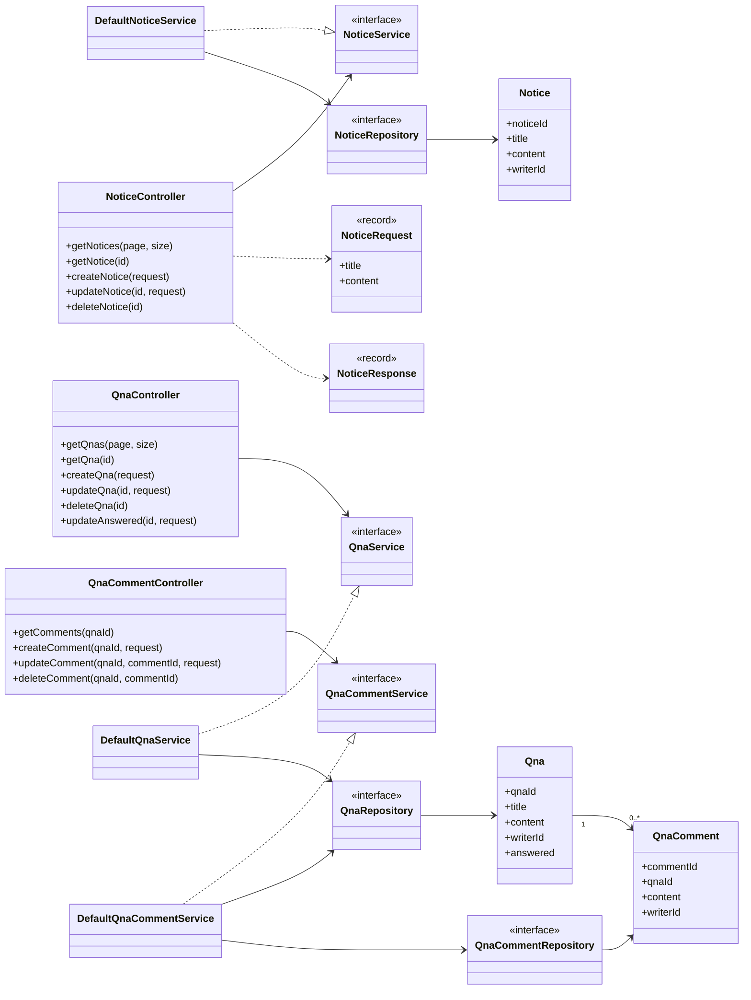
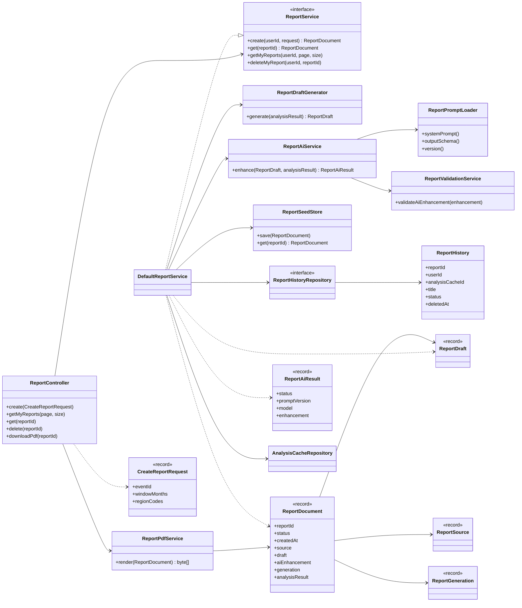
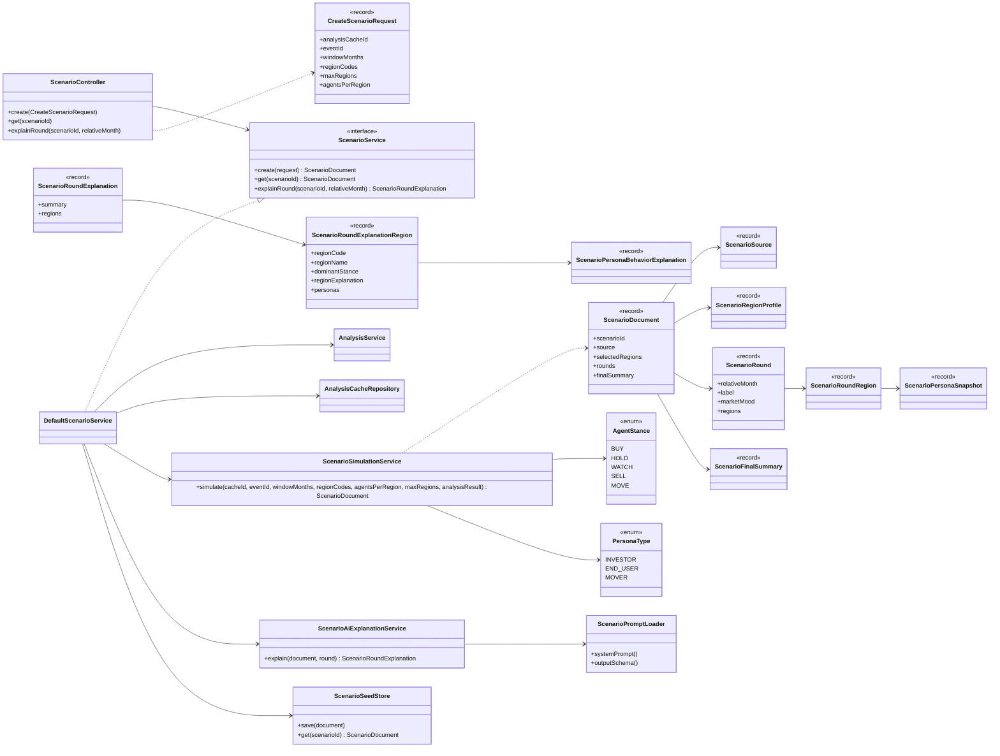
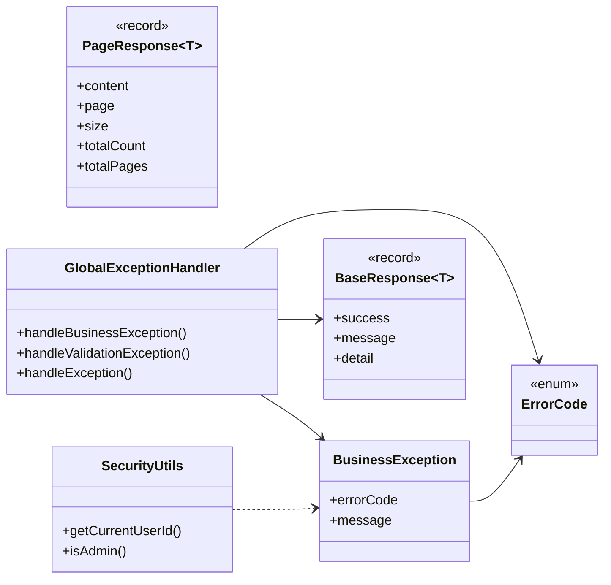

# EstateFlow 전체 클래스 다이어그램

이 문서는 EstateFlow의 주요 Spring Boot 백엔드 구조를 기준으로 작성한 클래스 다이어그램입니다.  
전체 흐름을 한 번에 파악할 수 있도록 `Controller - Service - Repository/Client - Entity/DTO` 관계를 중심으로 정리했습니다.

## 1. 전체 도메인 관계도

```mermaid
classDiagram
direction LR

class EstateFlowApplication {
  +main(args)
}

class SecurityConfig
class JwtAuthenticationFilter
class AuthTokenProvider
class SecurityUtils
class BaseTimeEntity {
  <<abstract>>
  +createdAt
  +updatedAt
}

class AuthController
class AuthService
class MemberController
class MemberService {
  <<interface>>
}
class DefaultMemberService
class MemberRepository {
  <<interface>>
}
class Member
class MemberRole {
  <<enum>>
}
class MemberStatus {
  <<enum>>
}

class AnalysisController
class AnalysisService {
  <<interface>>
}
class DefaultAnalysisService
class AiServerClient
class AnalysisCacheRepository {
  <<interface>>
}
class AnalysisCache
class AnalysisCacheKey

class DealController
class DealService {
  <<interface>>
}
class DefaultDealService
class MolitApiClient

class NoticeController
class NoticeService {
  <<interface>>
}
class DefaultNoticeService
class NoticeRepository {
  <<interface>>
}
class Notice

class QnaController
class QnaCommentController
class QnaService {
  <<interface>>
}
class QnaCommentService {
  <<interface>>
}
class DefaultQnaService
class DefaultQnaCommentService
class QnaRepository {
  <<interface>>
}
class QnaCommentRepository {
  <<interface>>
}
class Qna
class QnaComment

class ReportController
class ReportService {
  <<interface>>
}
class DefaultReportService
class ReportAiService
class ReportPdfService
class ReportDraftGenerator
class ReportPromptLoader
class ReportValidationService
class ReportSeedStore
class ReportHistoryRepository {
  <<interface>>
}
class ReportHistory

class ScenarioController
class ScenarioService {
  <<interface>>
}
class DefaultScenarioService
class ScenarioSimulationService
class ScenarioAiExplanationService
class ScenarioPromptLoader
class ScenarioSeedStore
class AgentStance {
  <<enum>>
}
class PersonaType {
  <<enum>>
}

EstateFlowApplication ..> SecurityConfig
SecurityConfig --> JwtAuthenticationFilter
JwtAuthenticationFilter --> AuthTokenProvider

AuthController --> AuthService
AuthService --> MemberRepository
AuthService --> AuthTokenProvider
AuthService --> Member

MemberController --> MemberService
DefaultMemberService ..|> MemberService
DefaultMemberService --> MemberRepository
MemberRepository --> Member
Member --|> BaseTimeEntity
Member --> MemberRole
Member --> MemberStatus

AnalysisController --> AnalysisService
DefaultAnalysisService ..|> AnalysisService
DefaultAnalysisService --> AiServerClient
DefaultAnalysisService --> AnalysisCacheRepository
DefaultAnalysisService --> AnalysisCacheKey
AnalysisCacheRepository --> AnalysisCache

DealController --> DealService
DefaultDealService ..|> DealService
DefaultDealService --> MolitApiClient

NoticeController --> NoticeService
DefaultNoticeService ..|> NoticeService
DefaultNoticeService --> NoticeRepository
NoticeRepository --> Notice
Notice --|> BaseTimeEntity

QnaController --> QnaService
QnaCommentController --> QnaCommentService
DefaultQnaService ..|> QnaService
DefaultQnaService --> QnaRepository
DefaultQnaService --> Qna
DefaultQnaCommentService ..|> QnaCommentService
DefaultQnaCommentService --> QnaCommentRepository
DefaultQnaCommentService --> QnaRepository
QnaRepository --> Qna
QnaCommentRepository --> QnaComment
Qna --|> BaseTimeEntity
QnaComment --|> BaseTimeEntity
Qna "1" --> "0..*" QnaComment

ReportController --> ReportService
ReportController --> ReportPdfService
DefaultReportService ..|> ReportService
DefaultReportService --> AnalysisCacheRepository
DefaultReportService --> ReportDraftGenerator
DefaultReportService --> ReportAiService
DefaultReportService --> ReportSeedStore
DefaultReportService --> ReportHistoryRepository
ReportAiService --> ReportPromptLoader
ReportAiService --> ReportValidationService
ReportHistoryRepository --> ReportHistory

ScenarioController --> ScenarioService
DefaultScenarioService ..|> ScenarioService
DefaultScenarioService --> AnalysisService
DefaultScenarioService --> AnalysisCacheRepository
DefaultScenarioService --> ScenarioSimulationService
DefaultScenarioService --> ScenarioAiExplanationService
DefaultScenarioService --> ScenarioSeedStore
ScenarioAiExplanationService --> ScenarioPromptLoader
ScenarioSimulationService --> AgentStance
ScenarioSimulationService --> PersonaType
```

## 2. 회원/인증 도메인

## 3. 분석/거래 조회 도메인

## 4. 게시판 도메인

## 5. AI 리포트 도메인

## 6. 시나리오 도메인

## 7. 공통/예외 처리

